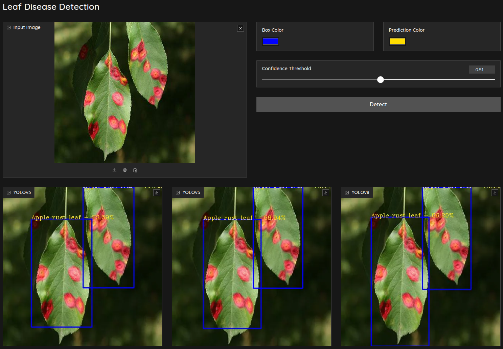

# Leaf Disease Detection

This project aims to detect leaf diseases on various plants using YOLOv3, YOLOv5 and YOLOv8.

🤗 [<b>Hugging Face link</b>](https://huggingface.co/spaces/umutkavakli/leaf-disease-detection) (Unfortunately, the code runs on CPU which makes it too slow.)

<center>   </center>

## Installation
You can run this project on your local computer easily if you have GPU support.

* Download pretrained weights from [<b>here</b>](https://drive.google.com/drive/folders/1I94RbtbR1rk3a2DBYy6ZOQxbbR8V3gyp?usp=sharing).

* Clone the repository and install required packages:

```
git clone https://github.com/umutkavakli/leaf-disease-detection.git
cd leaf-disease-detection
python -m venv .env
pip install -r requirements.txt
```
* Initialize the server:

```
python app.py
```

* You will see a URL like "<b>http://127.0.0.1:7860</b>" (might be different), copy and paste it into your browser.


